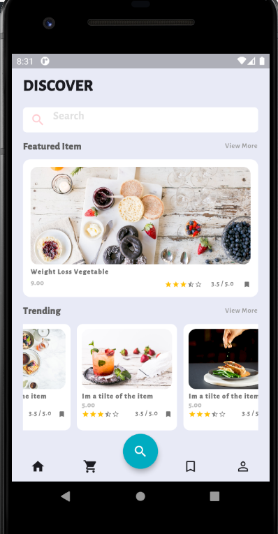
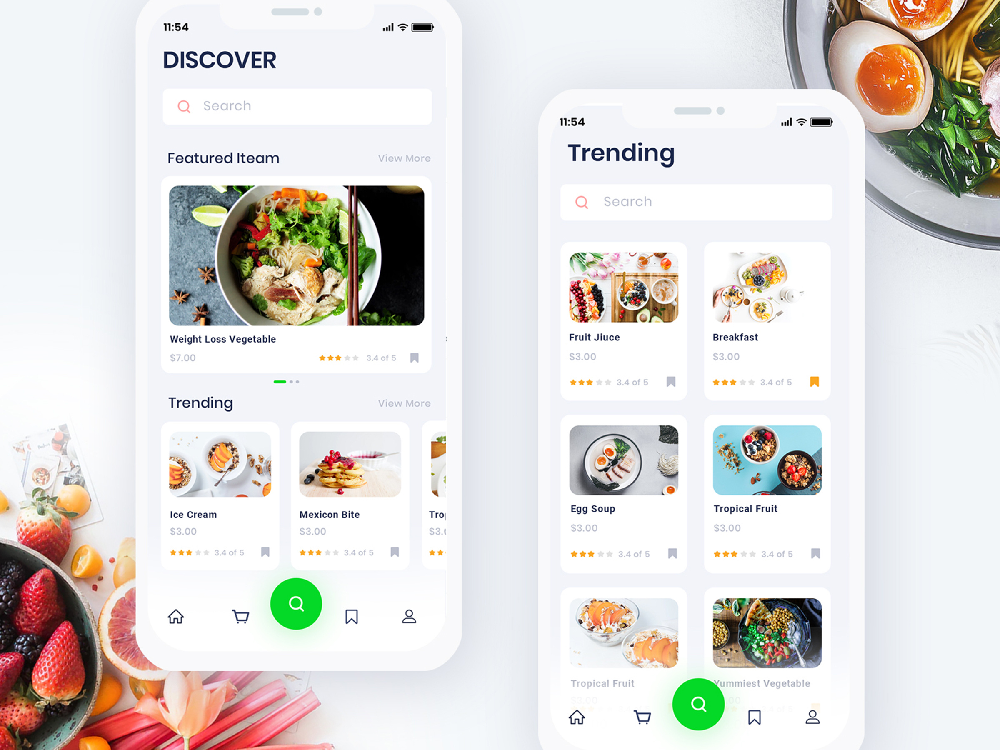

# Flutter_UI_FoodApp
Just a first time trying what i learned in Flutter, It require some touch ups for Font and colors but overall its good for a first time.

Design Template from Dribbble by [Nazmul Hassan](https://dribbble.com/shots/5933642-Food-App-Exploration?utm_source=Clipboard_Shot&utm_campaign=uixgeek&utm_content=Food%20App%20Exploration&utm_medium=Social_Share)

# Output 

# Original Design

